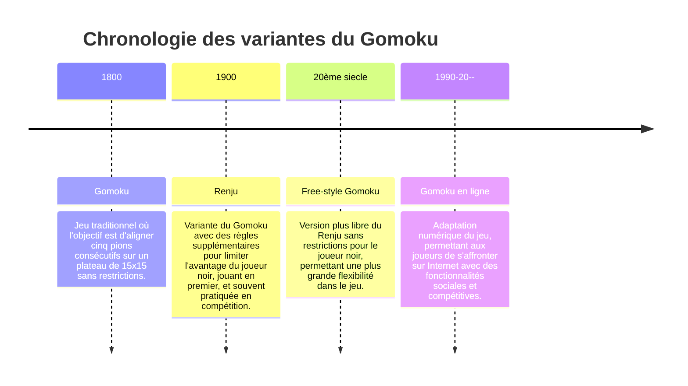

# Gomoku

***
Le Gomoku, du nom japonais ***gomoku narabe*** signifiant littéralement "alignement des cinq pions", est le nom japonais d'un jeu de plateau chinois, où il est nommé ***Wǔzi qí*** ("l'échiquier des 5") consistant à aligner 5 pions sur les intersections d'un plateau de ***jeu de go*** (ou ***wéiqí, 围棋***)
Il est également connu en France sous le nom de "**Darpion**"
***

## Règles du jeu
***
Se jouant sur un plateau quadrillé virtuel de 15x15,le but sera d'aligner 5 pions sur l'une des intersections du plateau. les joueurs jouent chacun leur tour n'importe où sur le plateau, l'un avec les pions blanc et l'autre avec les pions noir
Si les deux joueurs placent tous leurs pions sans qu'aucun ne parvienne à réaliser un alignement, le jeu est déclaré nul, et ils recommencent. Une partie se dispute généralement en deux manches, afin que celui qui a commencé avec les noirs ait les blancs la seconde fois.
***
# Contenu du répertoire

|**Fichier**                                    |**Description**                                                  |     
|---                                            |:-:                                                              |
|gomoku/gomoku_avec_bot/gomoku_affichage.py     | Procedure concernant l'affichage de l'interface utilisateur     |  
|gomoku/gomoku_avec_bot/gomoku_fus_bot.py       | Programme  principal doté du bot                                |    
|gomoku/gomoku_sans_bot/gomoku_affichage.py     | Procedure concernant l'affichage de l'interface utilisateur     |      
|gomoku/gomoku_sans_bot/gomoku_fus.py           | Programme principal sans le bot                                 |

# Les bibliothèques utilisées 

|**Bibliothèque**  |**Description**                              |     
|---               |:-:                                          |
|Tkinter           | gestion d'interface utilisateur             |  
|Random            | permet de generer des positions aléatoires  |    
|Imagetk           | affichage d'image                           |      
|gomoku_affichage  |gère l'affichage de l'interface utilisateur  |

# 🎯Stratégies de base
Meme si le jeu semble simple, il existe des stratégies complexes que les joueurs peuvent utiliser tel que:
***
- [x] Double menace : un coup qui crée deux alignements possibles de cinq pions.
- [x] Contrôle du centre : comme au go, le contrôle des intersections centrales offre souvent un avantage.
- [x] Blocage de l'adversaire : une bonne défense consiste à bloquer les alignements de l'adversaire avant
qu'il ne parvienne à placer ses cinq pions.
***

Envie d'en faire une partie ? plusieurs site vous permet de jouer dont [gomoku yiyao](gomoku.yjyao.com) que ce soit avec vos amis ou contre un bot qui vous donnera du fil à retordre.
vous avez meme la possibilité d'apprendre quelques astuces [en cliquant ici](https://fr.boardgamearena.com/doc/Tips_gomoku)
